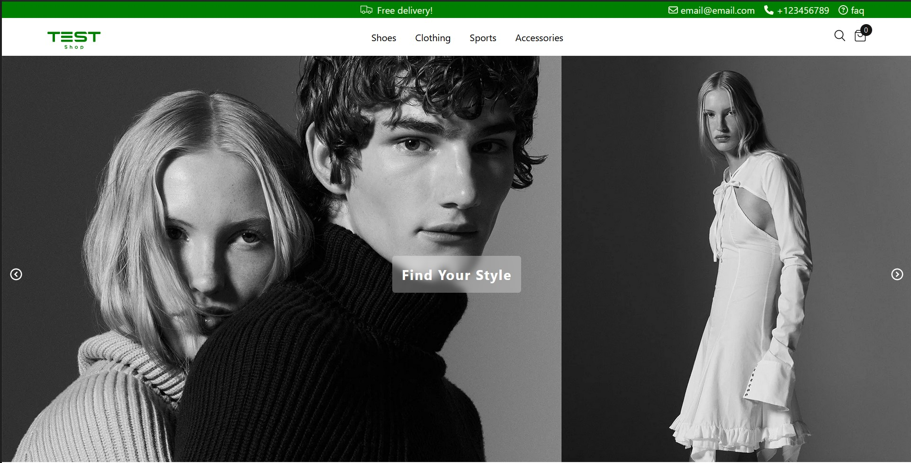

# Full Stack E-Commerce Website

Welcome to E-Commerce Website Project! This project is designed to provide a seamless online shopping experience, combining a powerful backend API with a responsive and dynamic frontend.



### [Try TestShop](https://flourishing-gumption-4b7314.netlify.app/)

## Texhnologies Used

Backend:
- NodeJS
- Express
- MongoDB

Frontend:
- React
- React Router
- Redux
- Redux Tollkit
- Sass

Async Operations:
- Redux Thunk
- Axios

## Project Overview

### Backend API
The backend uses NodeJS and Express, with MongoDB as the database of choice. The API provides robust routes for handling products, ensuring efficient data retrieval and manipulation.

### Frontend
The frontend is developed with React, offering a highly responsive and interactive user interface. React Router is employed for seamless navigation between different views. Sass styles the elements, allowing for a more modular and maintainable codebase. This enhances the consistency and aesthetics of the website.

### State Management and Data Fetching
Redux and Redux Toolkit are used for state management, providing a centralized and efficient way to handle application state. This is especially crucial for managing complex interactions. Redux Thunk and Axios are utilized for asynchronous data fetching from MongoDB. This ensures real-time updates and a snappy user experience by handling data operations

## Usage

### Backend
- Create a MongoDB database and obtain your `MongoDB URI` - [MongoDB Atlas](https://www.mongodb.com/cloud/atlas/register)
- Create `.env` file an add the following

```
PORT = 5500
MONGO_URI = your mongodb uri
```
### Install Dependencies (front&backend)

```
npm install
cd frontend
npm install
```

### Run

```

# Run frontend only
npm start

# Run backend only
npm run dev
```

## Build & Deploy

```
# Create frontend prod build
cd frontend
npm run build
```
